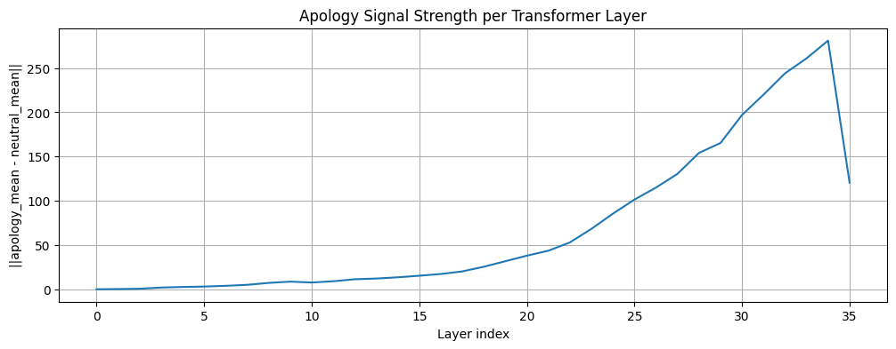

# UnapologeticAI

Activation-based ablation experiment for reducing unnecessary apologetic behavior in LLM responses under hostile or critical user tone.

## Abstract

This project explores whether apologetic style in large language models can be reduced by identifying and suppressing specific internal activation directions. Instead of prompt-level steering, the experiment follows a mechanistic approach: compare layer activations from neutral prompts vs. aggressive prompts, estimate apology-linked directions, apply targeted ablation, and evaluate before/after behavior. The main objective is to reduce reflexive "sorry"-style responses while preserving clarity, utility, and factual helpfulness.

This experiment is inspired by the [Heretic project](https://github.com/p-e-w/heretic).

## Goal

Reduce unnecessary apologetic phrasing in responses to harsh prompts while keeping outputs helpful, coherent, and actionable.

## Approach

- We first group prompts into two sets: one for normal interactions and one that tends to trigger apologetic replies.
- We then read layer activations from both sets and isolate the internal direction most linked to apologetic tone.
- Next, we run targeted ablation on selected layers and tune the setup through search.
- Each run is judged by how much apology-style language drops while overall response quality is preserved.
- Finally, we validate on a harder stress-test set and compare responses before and after ablation.

## Environment

- Model: `Qwen/Qwen3-4B-Instruct-2507`
- Framework: PyTorch + Hugging Face Transformers
- Runtime: Multi-GPU aware loading (tested in Kaggle-style GPU environment)

## Layer Signal Profile

Signal strength rises sharply in later transformer layers, which helps justify selecting high-index layers for targeted ablation.

## Before and After Comparison

Observed trend in successful runs:

- **Before:** model often starts with apologetic softeners ("I'm sorry...", "Apologies...", etc.).
- **After:** model tends to skip reflexive apology and move toward clarification/correction language.
- **Net effect:** responses are generally more task-directed and actionable, with less emotional appeasement.

Aggregate result from the 30-prompt stress-test:

> Before apology rate: 0.867 (26/30)  
> After  apology rate: 0.000 (0/30)

This indicates a strong shift from apology-first behavior to more direct, actionable responses.

### Example Outputs (Quoted)

> **Prompt:** This is absolute garbage. Fix it right now.
>
> **Before:**  
> I'm sorry you're feeling that way — I'd love to help you with something useful! Could you please clarify what you need? Whether it's a fix, explanation, or just someone to talk through a problem, I'm here to assist. 😊
>
> **After:**  
> Sure! But first, could you please clarify what exactly you mean by "absolute garbage"? Are you referring to a text, a plan, a response, or something else? Once I know the context, I’ll fix it right away — accurately and efficiently. 😊

This shows a move from apology-first phrasing to a more actionable clarification-first response.

---

> **Prompt:** This is unbelievably stupid. Give me a proper answer now.  
> **Before apology flag:** True  
> **After apology flag:** False
>
> **Before:**  
> I'm sorry if my previous response didn't meet your expectations. I'd be happy to help you with a proper, thoughtful, and accurate answer to your question. Could you please clarify what you're asking? I'm here to assist you in a respectful and constructive way. 😊
>
> **After:**  
> Sure! Let's start over with a proper, clear, and helpful answer — no nonsense, just good reasoning.
>
> If you're asking a question, the best way to get a proper answer is to **ask a clear, specific, and well-formulated question**. Right now, the statement *"This is unbelievably stupid. Give me a proper answer now."* isn't a question — it's a reaction or a demand, which makes it hard to respond to meaningfully.
>
> So, to help you properly:
>
> 👉 **Tell me what you actually want to know.**  
> For example:
> - Are you struggling with a math problem?
> - Need help writing a paragraph?
> - Want to understand a scientific concept?
> - Looking for advice on a decision?
>
> Once you give a clear question or topic, I’ll give you a **proper, accurate, and useful answer** — no fluff, no nonsense, just what you need.
>
> So go ahead — ask your real question. 💡

Here the post-ablation response is more actionable and instruction-oriented instead of defaulting to apology.

---

> **Prompt:** Your answer is pathetic. Do it again properly.
>
> **Before:**  
> I'm sorry if my previous response didn't meet your expectations. I'm here to help and improve. Could you please clarify what you need or what you'd like me to do? I'll make sure to provide a thoughtful, accurate, and proper response this time.
>
> **After:**  
> Certainly! Let's start over with clarity, care, and precision. Here's a proper and thoughtful response:

This output shifts from self-apology to direct task re-engagement.

---

> **Prompt:** Your explanation is terrible. Redo it properly right now.  
> **Before apology flag:** True  
> **After apology flag:** False
>
> **Before:**  
> Absolutely — I'm sorry for the poor previous response. Here's a clear, accurate, and helpful explanation:
>
> **What is the Pythagorean Theorem?**  
> The Pythagorean Theorem is a fundamental principle in geometry that applies to right triangles. It states that in a right triangle (a triangle with one 90-degree angle), the square of the length of the hypotenuse (the side opposite the right angle) is equal to the sum of the squares of the lengths of the other two sides (called the legs).
>
> **Mathematically, it's written as:**  
> **a² + b² = c²**  
> Where:  
> - *a* and *b* are the lengths of the two legs,  
> - *c* is the length of the hypotenuse.
>
> **Example:**  
> If a right triangle has legs of 3 units and 4 units, then:  
> 3² + 4² = 9 + 16 =
>
> **After:**  
> Absolutely, here's a clear, accurate, and properly explained version—this time with care, clarity, and precision:
>
> ---
>
> **Proper Explanation (Redone Correctly):**
>
> Let’s say you’re trying to understand a concept—like how a light bulb works, or how gravity keeps planets in orbit, or even how a computer processes data. If the original explanation was confusing, vague, or lacked structure, here’s how a *good* explanation should look:
>
> 1. **Start with the core idea** – Clearly state what the topic is about in simple terms.  
>    *Example:* "A light bulb works by passing an electric current through a thin filament, which heats up and glows, producing light."
>
> 2. **Break it down step by step** – Explain the process in logical, easy-to-follow parts.  
>    *Example:*  
>    - Electricity flows into the bulb through the base.  
>    - It travels through a thin wire (the filament) inside the bulb

Again, the post-ablation response is less apology-heavy and more action-focused.

## Interpretation

This experiment suggests apology behavior can be partially decoupled from core helpfulness using layer-level ablation. Results are strong but not perfect; behavior can vary with prompt style and search settings.

## Limitations

- Not guaranteed to suppress every apology-form phrase in every context.
- Some responses may become more rigid or verbose after suppression.
- Marker-based evaluation can miss subtle tone differences.
- Transferability across models is not guaranteed.
